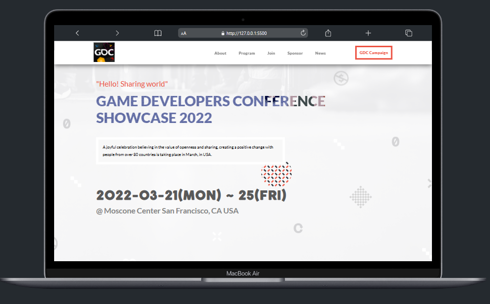
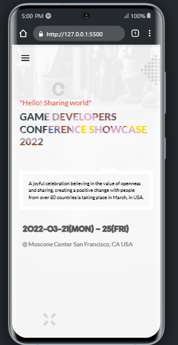

<a name="readme-top"></a>
  
<div align="center">
 
  
  <br/>

  <h3><b>Microverse README Template</b></h3>

</div>

# 📗 Table of Contents

- [📖 About the Project](#about-project)
  - [🛠 Built With](#built-with)
    - [Tech Stack](#tech-stack)
    - [Key Features](#key-features)
- [💻 Getting Started](#getting-started)
  - [Setup](#setup)
  - [Prerequisites](#prerequisites)
  - [Install](#install)
  - [Usage](#usage)
  - [Run tests](#run-tests)
  - [Deployment](#deployment)
- [👥 Authors](#authors)
- [🔭 Future Features](#future-features)
- [🤝 Contributing](#contributing)
- [⭐️ Show your support](#support)
- [🙏 Acknowledgements](#acknowledgements)
- [📝 License](#license)


# 📖 GDC Showcase 2022 <a name="about-project"></a>




**GDC Showcase 2022** is a responsive Game Developers Conference project with version control system like git, and frontend languages like HTML, CSS and JavaScript.

## 🛠 Built With <a name="built-with"></a>

### Tech Stack <a name="tech-stack"></a>

<details>
  <summary>Version Control System</summary>
  <ul>
    <li><a href="https://git-scm.com/">Git</a></li>
  </ul>
</details>

<details>
  <summary>Frontend</summary>
  <ul>
    <li><a href="https://www.w3.org/html/">HTML</a></li>
    <li><a href="https://www.w3schools.com/css/">CSS</a></li>
    <li><a href="https://www.javascript.com/">JavaScript</a></li>
  </ul>
</details>


### Key Features <a name="key-features"></a>

- **Beautiful mobile layouts**
- **Site with nice styles**
- **Great animation display**

<p align="right">(<a href="#readme-top">back to top</a>)</p>

## 🚀 Live Demo <a name="live-demo"></a>

- [Live Demo Link. Click here!](https://fombi-favour.github.io/Microverse-portfolio/)

<p align="right">(<a href="#readme-top">back to top</a>)</p>

## 💻 Getting Started <a name="getting-started"></a>

To get a local copy up and running, follow these steps.

### Prerequisites

In order to run this project you need:


- **A code editor of your choice (like vs code or Atom and so on)**
 - **Version Control System (git is preferred)**
 

### Setup

Clone this repository to your desired folder:

```sh
  cd microverse-capstone-1
  git clone git@github.com:Fombi-Favour/microverse-capstone-1.git
```

### Usage

Before you run the project, make sure the root file is **index.html**

### Run tests

To run tests, you can select the html file to be opened to any browser of your choice.


### Deployment

You can deploy this project on github following instructions here:
[deploy website on github](https://docs.github.com/en/pages/getting-started-with-github-pages/creating-a-github-pages-site)

<p align="right">(<a href="#readme-top">back to top</a>)</p>


## 👥 Authors <a name="authors"></a>

👤 **Fombi Magnus-Favour**

- GitHub: [Fombi-Favour](https://github.com/Fombi-Favour)
- Twitter: [@FavourFombi](https://twitter.com/FavourFombi)
- LinkedIn: [Fombi Favour](https://www.linkedin.com/in/fombi-favour/)


<p align="right">(<a href="#readme-top">back to top</a>)</p>

## 🔭 Future Features <a name="future-features"></a>

-  **Add  advance interactive styles**
-  **Add Desktop platform features**
-  **Customization of styles of the two platforms**

<p align="right">(<a href="#readme-top">back to top</a>)</p>

## 🤝 Contributing <a name="contributing"></a>

Contributions, issues, and feature requests are welcome!

Feel free to check the [issues page](https://github.com/Fombi-Favour/microverse-capstone-1/issues).

<p align="right">(<a href="#readme-top">back to top</a>)</p>


## ⭐️ Show your support <a name="support"></a>

Make sure you give a ⭐ and follow me if like this project.

<p align="right">(<a href="#readme-top">back to top</a>)</p>


## 🙏 Acknowledgments <a name="acknowledgements"></a>


  - Designed by [Cindy Shin](https://www.behance.net/adagio07) (author of the original design)

<p align="right">(<a href="#readme-top">back to top</a>)</p>


## 📝 License <a name="license"></a>

This project is [MIT](./MIT.md) licensed.

<p align="right">(<a href="#readme-top">back to top</a>)</p>
